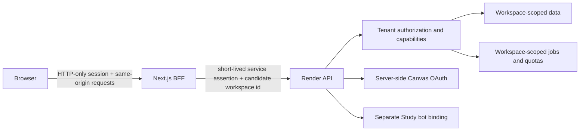

# Public Study dashboard boundary

Status: **Phase 7 architecture record only**. This document does not expose Study Mode, change
authentication, add a public bot, migrate data, or authorize deployment.

The canonical backend design is
[`PUBLIC_STUDY_ARCHITECTURE.md`](https://github.com/Henry336/threadwise/blob/main/docs/PUBLIC_STUDY_ARCHITECTURE.md),
with threats in
[`PUBLIC_STUDY_THREAT_MODEL.md`](https://github.com/Henry336/threadwise/blob/main/docs/PUBLIC_STUDY_THREAT_MODEL.md)
and staged delivery in
[`PUBLIC_STUDY_ROLLOUT.md`](https://github.com/Henry336/threadwise/blob/main/docs/PUBLIC_STUDY_ROLLOUT.md).

## Boundary decision

Public Study may have its own name, bot, landing surface, and eventually its own hostname, but the
browser remains a presentation client. The Render backend is the sole authority for identity,
membership, workspace capabilities, Canvas connections, jobs, quotas, audit, export, and deletion.
The browser never receives a Canvas access or refresh token, Telegram bot secret, database
credential, content-encryption key, or reusable provider credential.

## Current sealed projection

Today the dashboard:

- authenticates a human through verified Telegram Mini App data or Telegram OIDC;
- stores the selected personal or opaque workspace id in an HTTP-only cookie;
- sends a short-lived EdDSA service assertion from the BFF to Render;
- treats the selected workspace header as a candidate, never proof of access;
- discovers Study only after the backend's configured-owner, configured-chat, membership, and
  durable-binding checks all pass; and
- repeats the backend Study gate for every snapshot, mutation, protected file, search, and analysis
  request.

That path remains the founder-only compatibility adapter until a separately approved cutover. The
founder workspace is not an invite-cohort canary and must not appear in public workspace discovery.

## Target session and workspace flow

1. The user authenticates through a supported verified identity flow. The initial public Study
   cohort may continue using Telegram identity, but the data model must not encode “one configured
   Telegram owner” as the product tenancy rule.
2. The BFF creates an encrypted, signed, HTTP-only, secure, same-site session. JavaScript receives
   only bounded display identity and workspace capabilities.
3. `GET /workspaces` asks Render for workspaces the principal may currently access. Render derives
   this list from active tenant memberships and bot installations; the BFF does not synthesize it.
4. Selecting an opaque workspace id updates the HTTP-only candidate cookie. Every subsequent API
   request is re-authorized by Render against current membership, role, workspace state, and
   capability.
5. A removed, suspended, deleting, or otherwise unavailable workspace receives an opaque denial.
   The dashboard clears the stale selection and any workspace-scoped drafts, then returns to safe
   workspace discovery.

The workspace cookie is a convenience, not an authorization grant. Its accepted syntax may remain
`personal` or UUID, but an identifier must never carry a role or tenant secret.

## Backend-for-frontend invariants

- Keep authenticated requests same-origin through the existing BFF allowlist.
- Keep mutation origin checks, JSON-only request validation, request/response size limits,
  credential-free error mapping, and `Cache-Control: private, no-store`.
- Render derives the principal from the verified short-lived service assertion. Request bodies and
  query strings never supply a canonical user id, membership role, tenant id, quota tier, or bot id.
- Render resolves the candidate workspace id to an active membership on every request. Sensitive
  mutations additionally require a current capability and, where specified, recent reauthentication.
- The BFF must not broaden a route simply because the client UI hides an action.
- Server-sent events and any future WebSocket channel must use the same principal/workspace
  authorization and stop promptly after revocation.
- Browser-visible errors remain useful but do not reveal whether an inaccessible tenant, resource,
  connection, or bot installation exists.

Phase 6 finding F-02 must be remediated before an external cohort: service assertion JTIs are
validated today but not consumed against replay. The chosen implementation must be short-lived,
bounded, observable, and fail closed without turning the BFF into a reusable credential issuer.

## Canvas connection UX

Public Study must not offer a text box asking users to paste Canvas access tokens. The dashboard
flow is:

1. **Connect Canvas** starts a server-owned OAuth authorization request for the selected workspace.
2. The backend creates single-use state bound to the principal, workspace, intended return path,
   expiry, and PKCE verifier/challenge where supported.
3. The callback is handled server-side. The browser receives only a bounded result code and safe
   connection metadata such as institution hostname, account label, granted scope summary, last
   successful sync, and reconnect-required status.
4. Refresh/access tokens are envelope-encrypted in the backend and never enter browser state,
   telemetry, drafts, URLs, Telegram messages, or client error reports.
5. **Disconnect** and **Reconnect** are explicit, audited operations. Disconnect revokes upstream
   access where supported and makes future jobs fail closed.

Canvas pagination must accept only same-origin HTTPS next links from the connection's immutable
institution origin before an external cohort. This is Phase 6 finding F-01 and is a release blocker,
not a dashboard warning to dismiss.

## Product identity and bot setup

The public Study product can reuse this codebase while presenting a separate brand. A public Study
workspace setup screen may explain:

- which Study bot is being connected;
- whether the workspace is personal, shared, or institution-managed;
- which Telegram chat, if any, is bound;
- which capabilities the installer is granting; and
- how to disconnect, export, or delete the workspace.

The browser never accepts a raw bot token. A bot installation is selected from backend-configured
identities and confirmed by a server-observed Telegram event or other signed provider proof. The
existing Threadwise and Beacon multi-bot host is precedent for process sharing, not permission to
share bot secrets or routing state.

## Capability-driven interface

Do not infer authority from labels such as owner/admin in client code alone. Render returns a
bounded capability set for the selected membership, for example:

- `study.read`
- `study.capture`
- `study.manage_content`
- `study.manage_members`
- `study.manage_connections`
- `study.manage_workspace`
- `study.export`
- `study.delete`

The UI uses capabilities to explain and disable unavailable actions; the API remains authoritative.
Workspace suspension, deletion-pending state, quota exhaustion, reconnect-required connections, and
job backpressure need distinct non-sensitive UI states.

## Drafts, cached data, and account switching

- Authenticated application routes and API responses remain network-only and uncached by the service
  worker.
- Browser drafts remain versioned, expiring, and scoped to the verified principal, tenant,
  workspace, and resource. Logout, principal change, workspace revocation, or deletion clears
  incompatible drafts.
- Do not use `localStorage`, IndexedDB, analytics, or error-monitor breadcrumbs for Canvas material,
  note bodies, image OCR, analysis evidence, or access tokens unless a later privacy review defines
  an encrypted and consented design.
- Remote Markdown images remain consent-gated. Mermaid remains bounded, deferred, strict-mode, and
  sanitized. Public tenancy does not relax those controls.
- CSP report-only evidence must be clean before enforcement, and enforcement must be validated in
  the public Study brand/hostname as a separate deployment gate.

## Route and response design

Public Study should evolve the existing allowlisted BFF rather than create a generic pass-through.
Every added route records:

- exact methods and path shape;
- required capability;
- accepted content type and byte limit;
- tenant/workspace ownership checks;
- idempotency behavior;
- safe error codes;
- response fields and cache policy;
- audit event, if any; and
- rate-limit and abuse bucket.

Provider payloads, tokens, internal queue leases, raw AI prompts/responses, audit integrity material,
and cross-tenant identifiers never appear in dashboard contracts. Analysis results must carry
evidence references belonging to the same workspace and retain the existing “suggest, do not
silently edit” rule.

## Required multi-tenant validation

Before an invite cohort, automated and browser tests must cover at least:

- two unrelated Study tenants with overlapping local/public ids;
- owner, manager, member, removed member, suspended tenant, and deleting tenant roles/states;
- forged and stale workspace cookies;
- stale/replayed/expired service assertions, including F-02's final replay control;
- same resource id requested through the wrong tenant;
- cross-tenant mutation, search, protected media, SSE, analysis, export, and deletion attempts;
- Canvas connect/callback/disconnect with wrong state, wrong tenant, reused state, expired state, and
  cross-origin pagination;
- logout and account/workspace switching with local drafts present;
- CSP, remote Markdown image, Mermaid-budget, and protected-file behavior;
- quota/rate-limit/backpressure UI without revealing another tenant's activity; and
- founder workspace absence from public cohort discovery.

The cohort also requires Phase 6 F-03 principal/route rate limits and hosted isolated staging
evidence. Production activation remains independently approved.

## Rollback boundary

All public Study UI is feature-gated by product/tenant/cohort state returned from Render. Rolling
back the public surface removes cohort discovery and entry points without rewriting or deleting
founder data. The old founder adapter remains sealed during the cohort and is cut over only through
the backend rollout plan's explicit, reversible sequence.

## Next safe implementation unit

After explicit approval, Stage 7.1 may add tenant/workspace/membership foundations and capability
contracts behind disabled flags. It must not add public navigation, Canvas OAuth, a new bot secret,
external invitations, migrations in production, or founder cutover in the same change.
